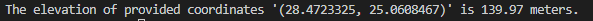

# GoogleMaps-Elevation-API
Coordinates go in, elevation goes out (it's Google Map's Elevation API)

Using [Google Maps API tools](https://developers.google.com/maps/documentation/javascript/elevation), this is the simplest code you can write to output elevation of any point on earth.

